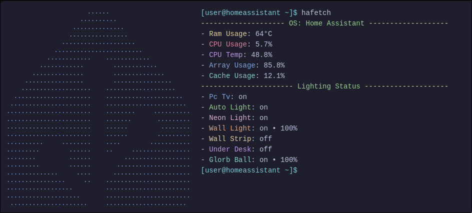

```markdown
# Hafetch - Terminal-Style Home Assistant Card

A Neofetch-inspired terminal dashboard card for Home Assistant, styled with [Catppuccin](https://github.com/catppuccin/catppuccin) and powered by Jinja2. Displays system stats, lighting states, and an animated cursor — right inside your dashboard.

---

## Features

- Terminal-style layout using monospace fonts and ASCII art
- System metrics: RAM, CPU, Temperature, Disk
- Smart light status with brightness
- Uses your own entities (fully customizable)
- Styled with Catppuccin color palette
- Animated blinking cursor
- Works directly in the UI via TailwindCSS Template Card — no YAML needed

---

## Screenshot



---

## Example Output

```

\[user\@homeassistant \~]\$ hafetch
\-------------------- OS: Home Assistant -------------------

* Ram Usage: 64°C
* CPU Usage: 5.7%
* CPU Temp: 48.8%
* Array Usage: 85.8%
* Cache Usage: 12.1%
  \---------------------- Lighting Status --------------------
* Pc Tv: on
* Auto Light: on
* Neon Light: on
* Wall Light: on • 100%
* Wall Strip: off
* Under Desk: off
* Glorb Ball: on • 100%
  \[user\@homeassistant \~]\$

````

---

## Dependencies

You'll need the following:

- [Home Assistant](https://www.home-assistant.io/)
- [TailwindCSS Template Card](https://github.com/Geek-RCJ/TailwindCSS-Template-card) (Install via HACS)

Example entities used (replace with your own):
- `sensor.ram_usage`, `sensor.cpu_usage`, `sensor.cpu_temperature`
- `sensor.disk_array_usage`, `sensor.disk_cache_usage`
- `media_player.tv_display`
- `switch.feature_neon`
- `automation.auto_lighting`
- `light.wall_lamp`, `light.strip_livingroom`, `light.desk_strip`, `light.rgb_ball`

---

## Setup Guide

### Step 1: Install TailwindCSS Template Card

1. Open Home Assistant
2. Go to **HACS > Frontend**
3. Install **TailwindCSS Template Card**
4. Refresh your browser

---

### Step 2: Add the Card

1. Go to your dashboard and click “**Add Card**”
2. Select `TailwindCSS Template Card` from the list
3. Paste the following code into the **HTML content** section:

```html
<div class="font-mono text-sm p-4 rounded-xl w-full overflow-x-auto" style="background-color:#1e1e2e; color:#cdd6f4;">
  <div class="grid grid-cols-[auto_1fr] gap-6">
    <pre class="leading-tight whitespace-pre-wrap text-[#89b4fa]">
                      ......                      
                    ..........                    
                  ..............                  
                 ................                 
               ....................               
             ........................             
           ............    ............           
         ............        ............         
       ..............        ..............       
     ................        ................     
    ...................    ...................    
  .....................    .....................  
 ......................    ...................... 
.......................    ........     ..........
.......................    .......       .........
.......................    ......         ........
.......................    ......        .........
..........     ........    ....        ...........
.........        ......    ..     ................
........         ......         ..................
.........        ......       ....................
..............     ....      .....................
................     ..    .......................
..................         .......................
....................       .......................
 .....................     ...................... 
</pre>

    <div class="text-base">
      <div><span class="text-[#89dceb]">[user@homeassistant ~]$</span> hafetch</div>
      <div class="text-[#f9e2af]">-------------------- <span class="text-[#a6e3a1]">OS: Home Assistant</span> -------------------</div>
      <div>  - <span class="text-[#f9e2af]">Ram Usage</span>: {{ states('sensor.ram_usage') | round(0) }}°C</div>
      <div>  - <span class="text-[#f38ba8]">CPU Usage</span>: {{ states('sensor.cpu_usage') }}%</div>
      <div>  - <span class="text-[#cba6f7]">CPU Temp</span>: {{ states('sensor.cpu_temperature') }}%</div>
      <div>  - <span class="text-[#89b4fa]">Array Usage</span>: {{ states('sensor.disk_array_usage') }}%</div>
      <div>  - <span class="text-[#94e2d5]">Cache Usage</span>: {{ states('sensor.disk_cache_usage') }}%</div>
      <div class="text-[#f9e2af]">---------------------- <span class="text-[#a6e3a1]">Lighting Status</span> --------------------</div>
      <div>- <span class="text-[#89b4fa]">Pc Tv</span>: {{ states('media_player.tv_display') }}</div>
      <div>- <span class="text-[#a6e3a1]">Auto Light</span>: {{ states('automation.auto_lighting') }}</div>
      <div>- <span class="text-[#f5c2e7]">Neon Light</span>: {{ states('switch.feature_neon') }}</div>
      <div>- <span class="text-[#fab387]">Wall Light</span>: 
        
          on • {{ (state_attr('light.wall_lamp', 'brightness') | float * 100 / 255) | round(0) }}%
        
          off
        
      </div>
      <div>- <span class="text-[#f9e2af]">Wall Strip</span>: 
        
          on • {{ (state_attr('light.strip_livingroom', 'brightness') | float * 100 / 255) | round(0) }}%
        
          off
        
      </div>
      <div>- <span class="text-[#cba6f7]">Under Desk</span>: 
        
          on • {{ (state_attr('light.desk_strip', 'brightness') | float * 100 / 255) | round(0) }}%
        
          off
        
      </div>
      <div>- <span class="text-[#94e2d5]">Glorb Ball</span>: 
        
          on • {{ (state_attr('light.rgb_ball', 'brightness') | float * 100 / 255) | round(0) }}%
        
          off
        
      </div>
      <div><span class="text-[#89dceb]">[user@homeassistant ~]$ </span><span class="cursor">&nbsp;</span></div>
    </div>
  </div>
</div>

<style>
@keyframes blink-caret {
  0%, 100% { background-color: transparent; }
  50% { background-color: #cdd6f4; }
}
.cursor {
  display: inline-block;
  width: 10px;
  height: 1em;
  animation: blink-caret 0.75s step-end infinite;
}
</style>
````

---

## Contributing

If you find bugs or want to suggest improvements, feel free to open a pull request or submit an issue.

---

## Credits

* Based on [Neofetch](https://github.com/dylanaraps/neofetch)
* Themed with [Catppuccin](https://github.com/catppuccin/catppuccin)

```

Let me know if you'd like this in a downloadable `.md` file or pushed as an update to your repo structure!
```
